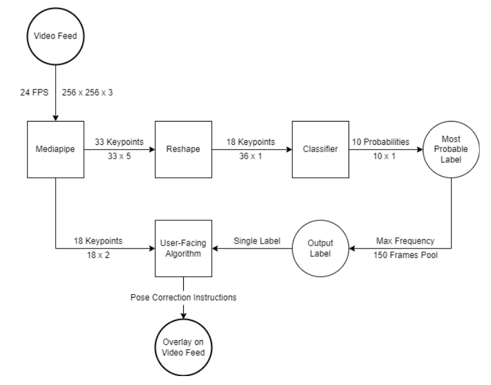

# DeepFit

**Your digital personal trainer**

Deepfit tracks your body movements throughout a workout. It will help correct for posture, keep track of your reps and make sure you get fit the right way.

# Quick Start
In a new environment, run `pip install -r requirments.txt`
## Deployment 
To run your own version of DeepFit, use `python3 deepfit_integration.py`
## Development 

To get started with your own predictions, you can use ```DeepFitClassifier.py```  

The classifier should use the TFLite model packaged as deepfit_classifier_v3.tflite.  

The input required is an array of size 36, which denotes the X coordinates and Y coordinates of 18 keypoints. 

See [Inference Notebook](/DeepFitClassifierInference.ipynb) for an example.  

# Demo


# Methodology



We have implemented a wrapper around the Pose Detection API from Google's AI framework, MediaPipe, to achieve three tasks:

## 1. Keypoint Detection 
The pre-trained MediaPipe landmark model in use is a Convolutional Neural Network and is trained with an input layer of size `[1,256,256,3]`, which is accepted as incoming video feed from the webcam (256 x 256 pixels’ RGB values). The result received from the output layer is of shape `[33, 5]`. It translates to the 33 keypoints being detected by the model. The 5 additional parameters in the output map to the X, Y, and Z coordinates in the image (or video frame) and two factors for visibility and presence. 
	
## 2. Pose Classification  
18 of the 33 detected keypoints are used to train a pose classifier. The model tells us what workout is being performed, which leads us to task 3. 

## 3. Pose Correction
Once the workout has been identified by our Classifier model, we use these keypoints to calculate the angles between limbs and compare it against benchmarks to identify if the person has an appropritate posture for an exercise. Apart from posture correction, these keypoints are also used to count the number of reps correctly performed for the workout. 
	

The following image shows the keypoints provided by the Pose Landmark Model from MediaPipe:


# Implementation

## Dataset

- We utilize the MMFit dataset to train a neural network to identify what exercise the person is performing. 
- MMFit dataset is a collection of inertial sensor data from smartphones, smartwatches and earbuds worn by participants while performing full-body workouts, and time-synchronised multi-viewpoint RGB-D video, with 2D and 3D pose estimates. 
- We make use of the 2D pose estimates present in MMFit.
- The data is split into train, test, and valdiation sets.
- Since the dataset is large, it is not part of the repo. It can be downloaded [here](https://s3.eu-west-2.amazonaws.com/vradu.uk/mm-fit.zip).
- The dataset originally contains around 1.1 million frames worth of data (~800 minutes of video), which was filtered out for training the model. We only retained the labeled frames and removed all the noise for our prototype. This left us with a total of 375,753 frames. 

## Input Normalization

Since we plan to work with a live video feed, input normalization becomes a crucial component of the architecture. The model should be agnostic about how far away a person is standing from the camera, the height of the person, or the camera angle. To counter all these variables, we use a technique outlined in the [MATEC paper](https://doi.org/10.1051/matecconf/201713205016) to normalize the keypoints around the center of gravity. For this, first, the length of the body is calculated using the distances between certain detected keypoints. 

## Model Architecture

- The input shape is of (36,). These denote the X and Y coordinates of the below 18 keypoints:  
```
        0: 'Nose', 
        1: 'Neck', 
        2: 'Right Shoulder', 
        3: 'Right Elbow', 
        4: 'Right Wrist',
        5: 'Left Shoulder',
        6: 'Left Elbow',
        7: 'Left Wrist',
        8: 'Right Hip',
        9: 'Right Knee',
        10: 'Right Ankle',
        11: 'Left Hip', 
        12: 'Left Knee',
        13: 'Left Ankle',
        14: 'Right Eye',
        15: 'Left Eye',
        16: 'Right Ear',
        17: 'Left Ear'
```
- The output provides the probability of the input falling under one of the 10 classes:  
```
{'squats': 0,
 'lunges': 1,
 'bicep_curls': 2,
 'situps': 3,
 'pushups': 4,
 'tricep_extensions': 5,
 'dumbbell_rows': 6,
 'jumping_jacks': 7,
 'dumbbell_shoulder_press': 8,
 'lateral_shoulder_raises': 9}
```

- A sequential model with 2 hidden layes and a dropout of 0.5 is used to prevent overfitting. Below is a Keras model summary: 
``` 
_________________________________________________________________
Layer (type)                 Output Shape              Param #   
=================================================================
dense_16 (Dense)             (None, 64)                2368      
_________________________________________________________________
dropout_12 (Dropout)         (None, 64)                0         
_________________________________________________________________
dense_17 (Dense)             (None, 32)                2080      
_________________________________________________________________
dropout_13 (Dropout)         (None, 32)                0         
_________________________________________________________________
dense_18 (Dense)             (None, 16)                528       
_________________________________________________________________
dropout_14 (Dropout)         (None, 16)                0         
_________________________________________________________________
dense_19 (Dense)             (None, 10)                170       
=================================================================
Total params: 5,146
Trainable params: 5,146
Non-trainable params: 0
_________________________________________________________________
```

- The loss function used is sparse_categorical_crossentropy. A learning rate of 0.01 is used.

- The final model is trained over 20 epochs with a final validation accuracy of 96%. 


## Evaluation

### Training 
Below is a training summary:  

```
	  loss	    accuracy	val_loss  val_accuracy
0	1.252045	0.495268	0.732308	0.735186
1	0.921984	0.630895	0.566991	0.813796
2	0.815697	0.677609	0.491321	0.849905
3	0.768847	0.696643	0.455569	0.857286
4	0.736345	0.708929	0.440884	0.856609
5	0.712233	0.717381	0.432064	0.840261
6	0.695734	0.727119	0.389068	0.869760
7	0.674996	0.739538	0.367630	0.903864
8	0.655524	0.753477	0.311917	0.919548
9	0.630738	0.777112	0.256255	0.940582
10	0.600421	0.794850	0.232311	0.943643
11	0.573990	0.806593	0.228085	0.949643
12	0.554955	0.811873	0.219740	0.941855
13	0.545057	0.815917	0.212951	0.950672
14	0.533646	0.821068	0.203407	0.961020
15	0.524324	0.824082	0.196768	0.963837
16	0.521022	0.824856	0.204978	0.964758
17	0.514664	0.827558	0.196479	0.965287
18	0.507603	0.830561	0.204903	0.956131
19	0.499035	0.834542	0.184986	0.967657
```


### Held-out data

- Loss: 0.1938
- Accuracy: 0.9588

# Example

Here's an example pose recognized, normalized, and classified. 


# References
A big thanks to [@akshaybahadur21](https://github.com/akshaybahadur21) and [@tringn](https://github.com/tringn) for sparking inspiration for this project ❣  
- Hand Keypoint Detection in Single Images using Multiview Bootstrapping  
https://arxiv.org/abs/1704.07809
- Realtime Multi-Person 2D Pose Estimation using Part Affinity Fields  
https://arxiv.org/pdf/1611.08050.pdf
- MediaPipe  
https://google.github.io/mediapipe/
- TensorFlow Pose Estimation  
https://www.tensorflow.org/lite/examples/pose_estimation/overview  
- 2D Keypoints based Pose Classifier  
https://github.com/tringn/2D-Keypoints-based-Pose-Classifier 
- Classification of a two-dimensional pose using a human skeleton  
https://doi.org/10.1051/matecconf/201713205016 
- MMFit Dataset  
https://github.com/KDMStromback/mm-fit  
https://doi.org/10.1145/3432701 
- MediaPipe Documentation   
https://google.github.io/mediapipe/getting_started/python_framework.html
- Motion tracking with MediaPipe   
https://developers.googleblog.com/2020/08/instant-motion-tracking-with-mediapipe.html

