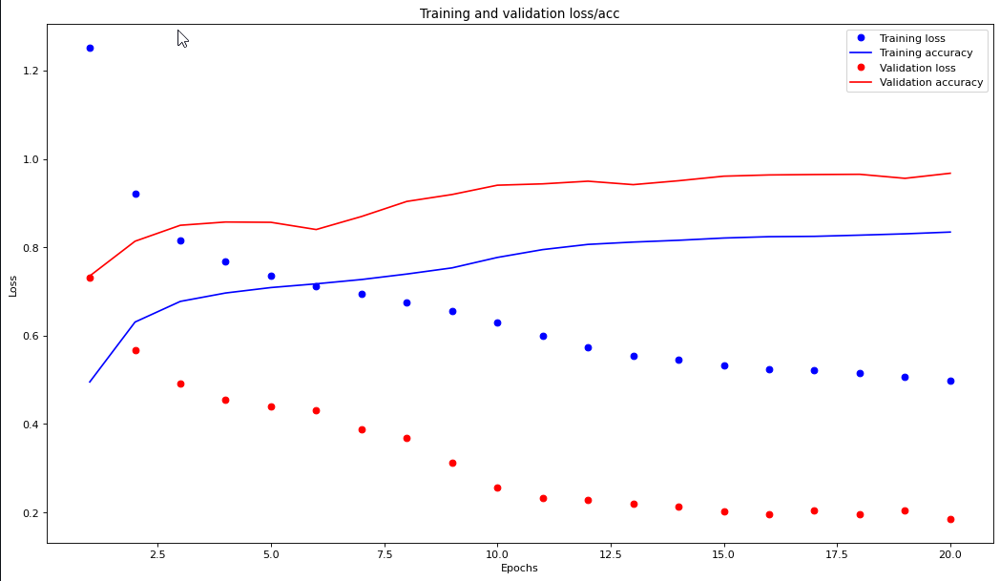

# DeepFit

**Your digital personal trainer**

Deepfit can be used to track your body movements throughout a workout. It will help correct for posture, keep track of your reps and make you sure you get fit the right way.

# Wrapper

- We make use of the MediaPipe Pose Detection API to detect 18 keypoints on the body of a single subejct in frame.
- The model is fine-tuned and we calculate the angles between limbs and compare it against benchmarks to figure out if the person is an appropritate posture for an exercise. 

# Quick Start

To get started with your own predictions right away, you can use ```DeepFitClassifier.py```  

The classifier should use the TFLite model packaged as deepfit_classifier_v3.tflite.  

The only input required is an array of size 36, which denotes the X coordinates and Y coordinates of 18 keypoints. 

See [Inference Notebook](/DeepFitClassifierInference.ipynb) for an example. 

# Classifier

## Dataset

- We utilize the MMFit dataset to train a neural network to identify what exercise the person is performing. 
- MMFit dataset is a collection of inertial sensor data from smartphones, smartwatches and earbuds worn by participants while performing full-body workouts, and time-synchronised multi-viewpoint RGB-D video, with 2D and 3D pose estimates. 
- We make use of the 2D pose estimates present in MMFit.
- The data is split into train, test, and valdiation sets. 

## Training

- The input shape is of (36,). These denote the X and Y coordinates of the below 18 keypoints:  
```
        0: 'Nose', 
        1: 'Neck', 
        2: 'Right Shoulder', 
        3: 'Right Elbow', 
        4: 'Right Wrist',
        5: 'Left Shoulder',
        6: 'Left Elbow',
        7: 'Left Wrist',
        8: 'Right Hip',
        9: 'Right Knee',
        10: 'Right Ankle',
        11: 'Left Hip', 
        12: 'Left Knee',
        13: 'Left Ankle',
        14: 'Right Eye',
        15: 'Left Eye',
        16: 'Right Ear',
        17: 'Left Ear'
```
- The output provides the probability of the input falling under one of the 10 classes:  
```
{'squats': 0,
 'lunges': 1,
 'bicep_curls': 2,
 'situps': 3,
 'pushups': 4,
 'tricep_extensions': 5,
 'dumbbell_rows': 6,
 'jumping_jacks': 7,
 'dumbbell_shoulder_press': 8,
 'lateral_shoulder_raises': 9}
```

- A sequential neural network with 3 hidden layes and a dropout of 0.5 is used. Below is a model summary: 
``` 
_________________________________________________________________
Layer (type)                 Output Shape              Param #   
=================================================================
dense_16 (Dense)             (None, 64)                2368      
_________________________________________________________________
dropout_12 (Dropout)         (None, 64)                0         
_________________________________________________________________
dense_17 (Dense)             (None, 32)                2080      
_________________________________________________________________
dropout_13 (Dropout)         (None, 32)                0         
_________________________________________________________________
dense_18 (Dense)             (None, 16)                528       
_________________________________________________________________
dropout_14 (Dropout)         (None, 16)                0         
_________________________________________________________________
dense_19 (Dense)             (None, 10)                170       
=================================================================
Total params: 5,146
Trainable params: 5,146
Non-trainable params: 0
_________________________________________________________________
```

- The loss function used is sparse_categorical_crossentropy. A learning rate of 0.01 is used.

- The final model is trained over 20 epochs with a final validation accuracy of 96%. 


## Evaluation

### Training 
Below is a training summary:  

```
	  loss	    accuracy	val_loss  val_accuracy
0	1.252045	0.495268	0.732308	0.735186
1	0.921984	0.630895	0.566991	0.813796
2	0.815697	0.677609	0.491321	0.849905
3	0.768847	0.696643	0.455569	0.857286
4	0.736345	0.708929	0.440884	0.856609
5	0.712233	0.717381	0.432064	0.840261
6	0.695734	0.727119	0.389068	0.869760
7	0.674996	0.739538	0.367630	0.903864
8	0.655524	0.753477	0.311917	0.919548
9	0.630738	0.777112	0.256255	0.940582
10	0.600421	0.794850	0.232311	0.943643
11	0.573990	0.806593	0.228085	0.949643
12	0.554955	0.811873	0.219740	0.941855
13	0.545057	0.815917	0.212951	0.950672
14	0.533646	0.821068	0.203407	0.961020
15	0.524324	0.824082	0.196768	0.963837
16	0.521022	0.824856	0.204978	0.964758
17	0.514664	0.827558	0.196479	0.965287
18	0.507603	0.830561	0.204903	0.956131
19	0.499035	0.834542	0.184986	0.967657
```



### Held-out data

- Loss: 0.1938
- Accuracy: 0.9588


# References
- Hand Keypoint Detection in Single Images using Multiview Bootstrapping
https://arxiv.org/abs/1704.07809
- Realtime Multi-Person 2D Pose Estimation using Part Affinity Fields
https://arxiv.org/pdf/1611.08050.pdf
- Convolutional Pose Machines  
https://arxiv.org/abs/1602.00134
- OpenPose  
https://github.com/CMU-Perceptual-Computing-Lab/openpose 
- MediaPipe  
https://google.github.io/mediapipe/
- 2D Keypoints based Pose Classifier  
https://github.com/tringn/2D-Keypoints-based-Pose-Classifier 
- Classification of a two-dimensional pose using a human skeleton  
https://doi.org/10.1051/matecconf/201713205016 
